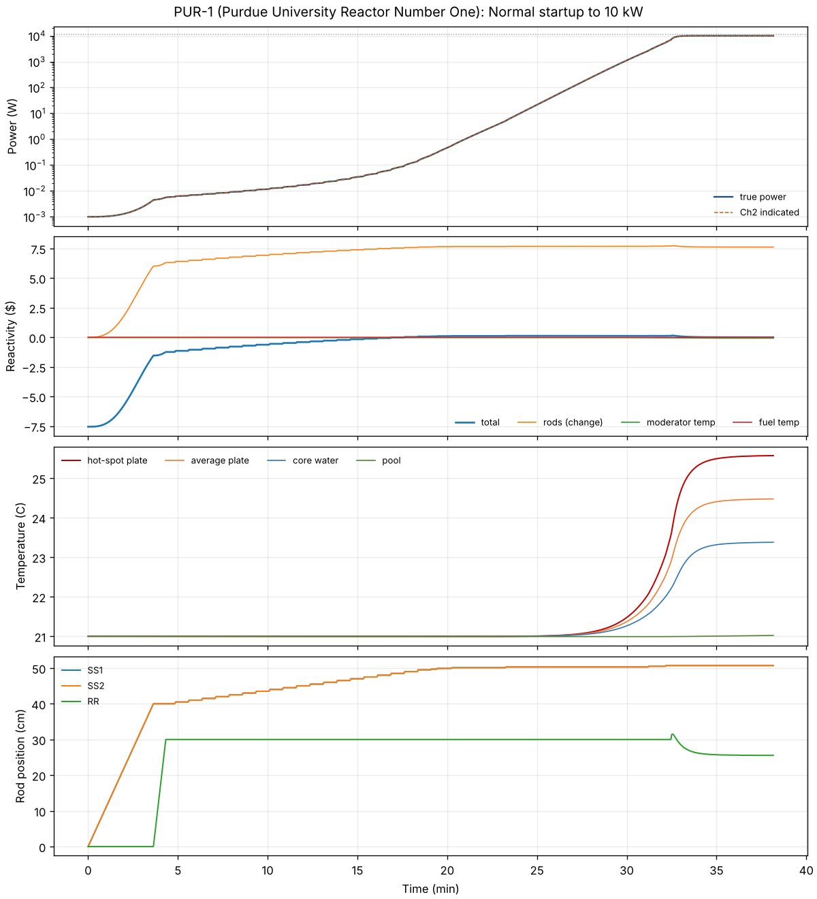
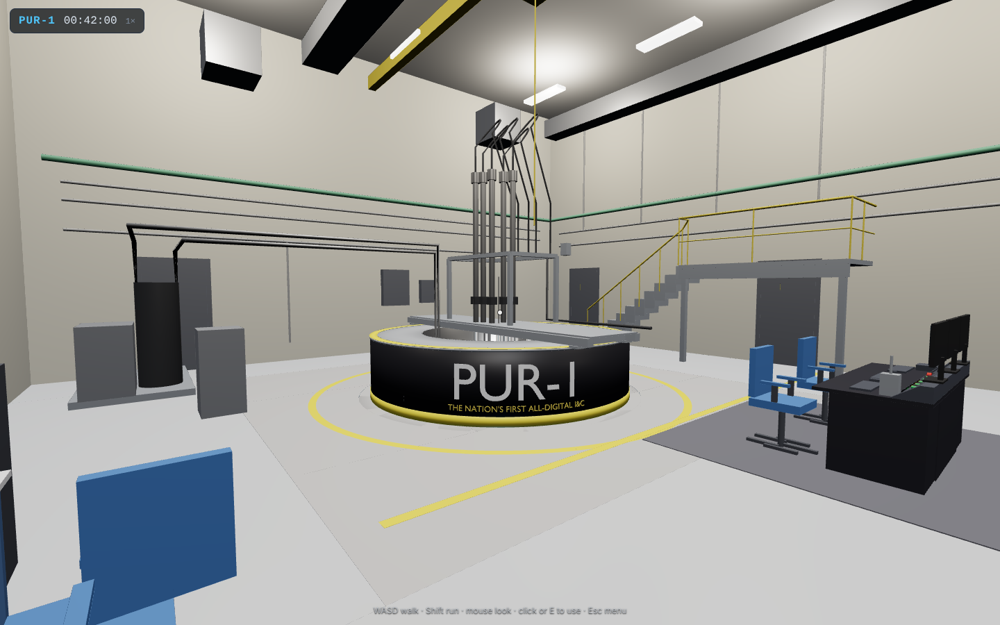
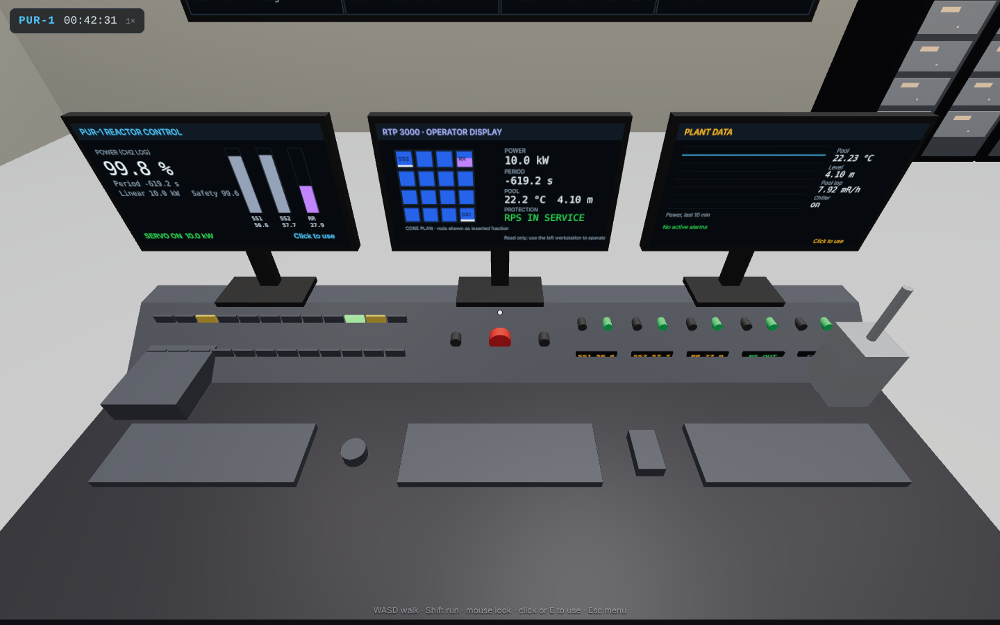
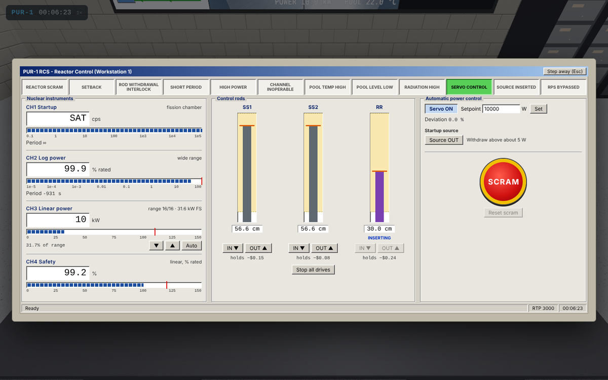
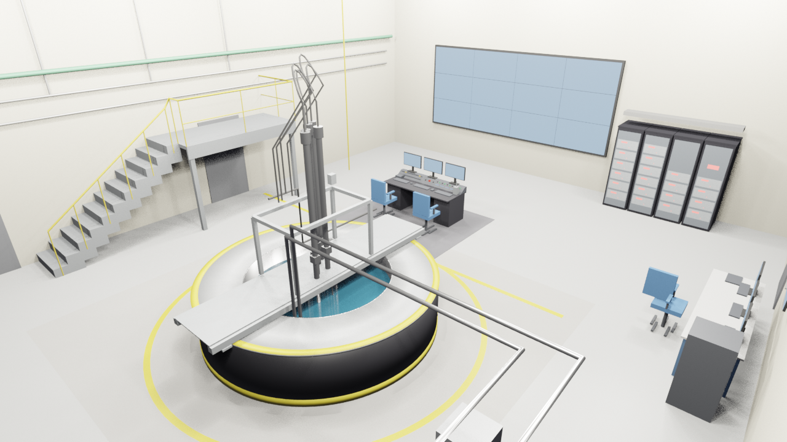

# reactorsim

A physics-first nuclear reactor simulator. It is built to be a credible engineering
model first and a control-room experience second, and it is designed to grow from
one reactor to many.

The first reactor is **PUR-1**, Purdue University's 10 kW pool research reactor
and the first US reactor licensed with an all-digital safety and control system.
It is the test bed: a small, well-documented core whose digital controls can be modeled one-for-one.



## What it models

| Area | Model |
| --- | --- |
| Neutron kinetics | Point kinetics, PUR-1's own 6 delayed groups, Pu-Be startup source; advanced exactly with a matrix exponential, so prompt-critical bursts are stable and accurate |
| Feedback | Fuel (Doppler), moderator temperature, and void from subcooled and bulk boiling |
| Thermal hydraulics | Fuel plates, core channel water and pool as heat-capacity nodes; natural circulation; boiling curve with critical heat flux and film boiling; chiller with thermostat; pool draining below the core |
| Poisons and fuel | I-135/Xe-135 and Pm-149/Sm-149 chains; U-235 depletion; 17-group decay heat |
| Control rods | S-shaped worth curves, motor drive speeds, electromagnet gravity scram, re-latching after a scram, stuck and runaway drive faults |
| Instruments | PUR-1's four neutron channels (startup fission chamber, log-N, linear with 16 ranges, safety), period meters, counting noise, radiation monitors; fault modes: fail low/high, stuck, gain error, drift, HV loss |
| Protection and control | Scrams, gang-lower setbacks, withdrawal interlocks (including one rod at a time) at PUR-1's setpoints; regulating-rod power servo; failed-trip and failed-RPS modes for licensing and beyond-design accidents |
| Consequences | Fuel safety limit, cladding blistering and melting, fission-product release into the pool, dose rates as shielding water is lost |

Every PUR-1 number, where it came from, and which ones are still assumptions are in
[docs/pur1_reference.md](docs/pur1_reference.md). The values follow the project's PUR-1
Simulator Parameter Sheet (SAR 2008/2015, Technical Specifications, digital twin paper).

## Quick start

```bash
pip install -e .[dev]
python -m reactorsim list
python -m reactorsim run startup --plot startup.png
python -m pytest            # 32 validation tests
```

```python
from reactorsim import Simulator

sim = Simulator("pur1")
sim.initialize_at_power(10_000)          # critical at 10 kW
sim.set_servo(True, 10_000)
sim.insert_reactivity(0.003)             # an experiment at the tech-spec limit
sim.run(60)
print(sim.status()["scram_causes"])      # period and power scrams
```

## Control room (Mac app)



You are an operator standing in the PUR-1 reactor hall, modelled on the real room: the round
black pool wall with the PUR-1 graphic and its yellow safety rim, the bridge with the five drive
housings over the water, the stair up to the north platform, the tiled video wall on the east
wall, the black digital I&C cabinets with their red LED readouts, and the desk console with
three monitors and blue chairs a few steps from the pool. Walk around it in first person
(WASD, Shift to run, mouse to look), climb the stair for a view down into the pool, and operate
the reactor from the console:

- **Workstation 1, reactor control** (left-hand monitor): the four neutron channels, rod
  drives you hold to move, linear-channel ranging, the servo, the startup source, scram and
  reset, and the annunciators.
- **Workstation 2, plant data** (right-hand monitor): the power history, a core camera, pool and
  radiation readings, reactivity and the event log.
- **RTP 3000 operator display** (centre monitor): a read-only core mimic with the rod
  positions, power, period, pool and protection status.
- **Hard-wired controls** on the console: hold a rod drive's UP or DOWN button to move it,
  the red manual scram button, the magnet power switch (scram) and the master key switch
  (scram reset), plus NS buttons for the startup source. The hallway scram button by the
  south door works too.



The monitors, rod position readouts, annunciator lamps and the 4 x 3 video wall show the live
plant, and the blades in the core move with the rods. Esc opens a menu with the simulation
speed (1x to 100x), restart, true plant values and the instructor station, which injects
experiments, rod and instrument faults, a chiller trip, a pool leak and protection failures.



**Install the app.** Every merge to `main` that touches the simulator builds
`PUR-1 Simulator.app` for Apple silicon and publishes it on the repository's
[Releases](../../releases) page as `PUR-1-Simulator-macOS.zip`.

1. Download the zip from the latest release, unzip it and drag the app to Applications.
2. The app is not signed with an Apple developer certificate, so macOS blocks the first
   launch. Open it once, then go to System Settings > Privacy & Security and click
   **Open Anyway** (or run `xattr -dr com.apple.quarantine "/Applications/PUR-1 Simulator.app"`).
3. That is all: the repository is public, so the app needs no token to see new builds. (The
   **Updates** dialog still accepts an optional GitHub token, which raises the API rate limit
   and keeps updates working if the repository is ever made private; it is stored only on
   that Mac.)

From then on the app checks for a newer build when it opens, and **Install and restart**
downloads it, swaps it in place and relaunches.

**Run it from source** (any OS):

```bash
pip install -e .[app]        # pywebview gives it its own window; without it, it opens in the browser
python -m reactorsim app     # or: python -m reactorsim app --browser --initial power_10kw
```

Build the app yourself on a Mac with `pip install ".[mac]"`,
`python packaging/macos/make_icon.py` and `pyinstaller packaging/macos/pur1.spec`.

## 3D models

Scripted Blender (`bpy`) models of the PUR-1 reactor hall, core and console area,
exported as glTF for the control-room interface, live in [models/](models/README.md).



## Scenarios

| Scenario | What happens |
| --- | --- |
| `startup` | Cold shutdown to 10 kW following the startup procedure, one rod at a time (about 37 minutes) |
| `scram` | Scram from 10 kW: prompt drop, then the stable negative period (about -75 s) |
| `xenon` | 40 h at power, then shutdown; shows why xenon barely matters at 10 kW |
| `experiment` | A 0.003 dk/k experiment inserted at full power |
| `rod_withdrawal` / `rod_withdrawal_atws` | A shim drive runs away, with and without protection |
| `reactivity_accident` / `reactivity_accident_large` | Hypothetical $1.50 and $4.00 step insertions with the RPS failed |
| `loss_of_chiller` | Pool heats about 0.33 C/h at 10 kW; temperature alarm after about 24 h |
| `loss_of_pool_water` | A pool leak: radiation monitors scram the reactor, then the core is uncovered |
| `calibration_error` | Recreates the 2019-2020 event where new instruments read 3x low |
| `linear_channel_failure` | The servo's channel reads half of true power; the safety channel has to catch the rise |
| `sar_step_scram`, `sar_ramp_scram`, `sar_step_no_scram` | The licensing-basis 0.6% dk/k insertions from the SAR, for benchmarking |

## Validation so far

| Check | Reference | Simulator |
| --- | --- | --- |
| Period after scram | -1/lambda_1 = -75 s for PUR-1's group data | -75 s |
| Stable periods for step insertions | inhour equation | within 2% |
| Prompt jump | beta / (beta - rho) | within 3% |
| Banked critical rod height | about 53.5 cm (SAR 2008) | 53.9 cm |
| Shutdown margin | 0.018 measured | 0.018 |
| 0.6% step from 12 kW, scram at 18 kW actual | 46.4 kW at 0.173 s (SAR, PARET) | 55 kW at 0.172 s |
| 0.6% over 10 s from 12 kW | 18.4 kW (SAR, PARET) | 18.4 kW |
| Hot clad at 18 kW | about 43 C (SAR, NATCON) | 44.7 C |
| Pool heat-up without chiller at 10 kW | about 0.36 C/h | 0.33 C/h |
| Instruments reading 3x low | 2019-2020 event: above 12 kW whenever indicated passed about 4 kW | 30 kW true at 10 kW indicated |
| Fuel damage threshold, no scram | SPERT-I plate core: no damage around $1.5, melting at $3.3 | none at $1.50, blistering from about $2.5, melting at $3.3 |

Remaining gaps against the licensing analyses are listed in
[docs/pur1_reference.md](docs/pur1_reference.md#benchmarks-against-the-licensing-analyses).

## Layout

```
reactorsim/
  physics/     kinetics, thermal, poisons, burnup, decay heat (reactor independent)
  plant/       rods, instruments, radiation, protection, servo
  reactors/    one module per reactor design (pur1.py)
  simulator.py the control loop and operator actions
  scenarios.py scripted operations and accidents
  app/         control room: live session, local server, web page, updater
packaging/     Mac app build (PyInstaller)
tests/         validation tests
docs/          reference data and plots
```

Adding a reactor means writing one `ReactorDesign` in `reactorsim/reactors/`. Larger
power reactors will need a spatial core model and a primary loop, which slot in
beside the current lumped models.

## Roadmap

1. PUR-1 reference data (done; open questions in the reference doc)
2. Core physics engine with validation (this release)
3. Control system detail and a fuller accident set
4. Control-room operator interface on top of the engine (first version: the Mac app)
